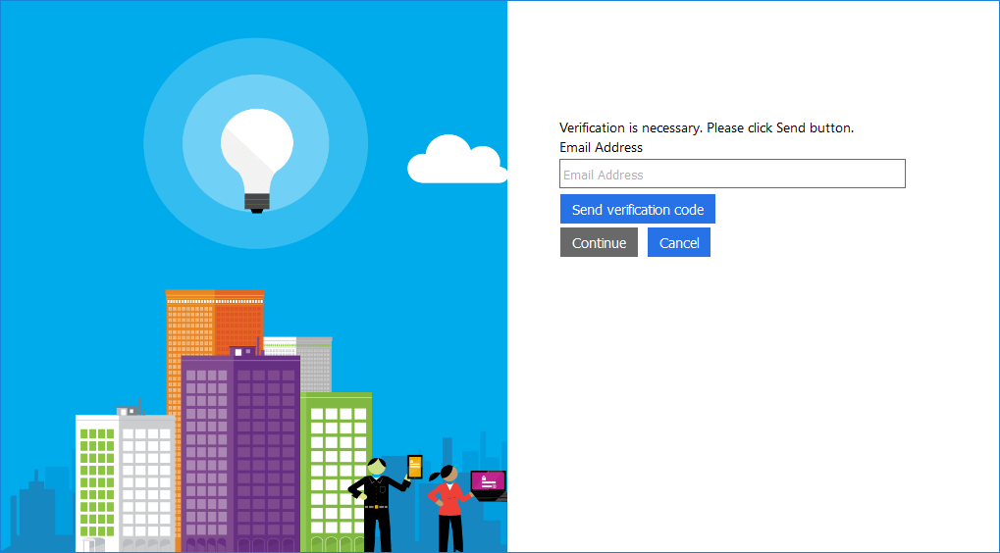
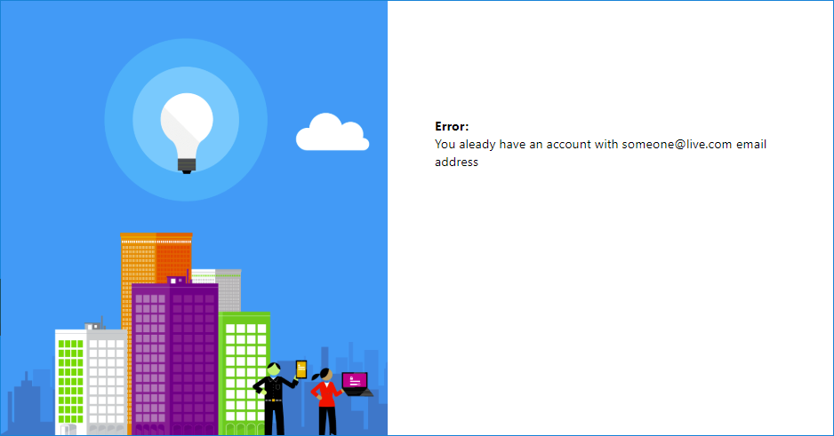

# Sign-in with social identity provider and force email uniqueness

When sign-in with social account, in some scenarios,  the identity provider doesn't share the email address. This sample demonstrates how to force the user to provide and validate email address, and also checks there is no other account with the same email address.

Examples when identity provider may not share the user's email address:
* A user sign-in with facebook account via phone number (instead of email address)
* During the sign-in (on the consent page), user choose not to share the email address with Azure AD B2C
* Some of the social identity providers don't share the email address

In those scenarios, the policy checks if the email address is empty. If yes, user is asked to provide and validate the email address.

> Note: You can remove the orchestration step's precondition, and force the user to validate the email address, even if the social identity provider shares the email address.

After the email is provided or verified, the policy checks if there is such a local with the same email address. If yes, the policy presents an error message.

## Disclaimer
The sample is developed and managed by the open-source community in GitHub. The sample policy is not part of Azure AD B2C product and it's not supported under any Microsoft standard support program or service. The sample (Azure AD B2C policy and any companion code) is provided AS IS without warranty of any kind.

> Note:  This sample policy is based on [SocialAndLocalAccounts starter pack](https://github.com/Azure-Samples/active-directory-b2c-custom-policy-starterpack/tree/master/SocialAndLocalAccounts). All changes are marked with **Demo:** comment inside the policy XML files. Make the nessacery changes in the **Demo action required** sections.